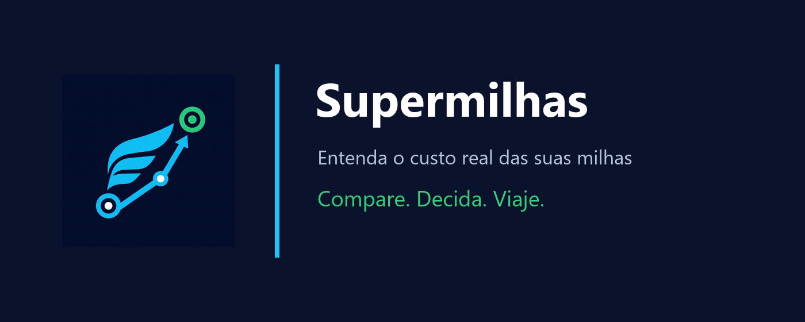
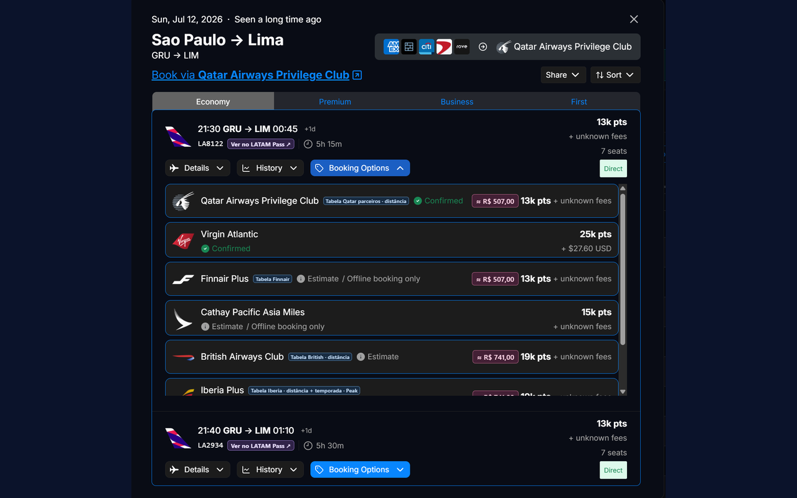
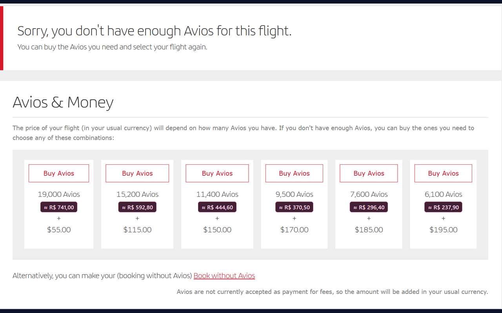
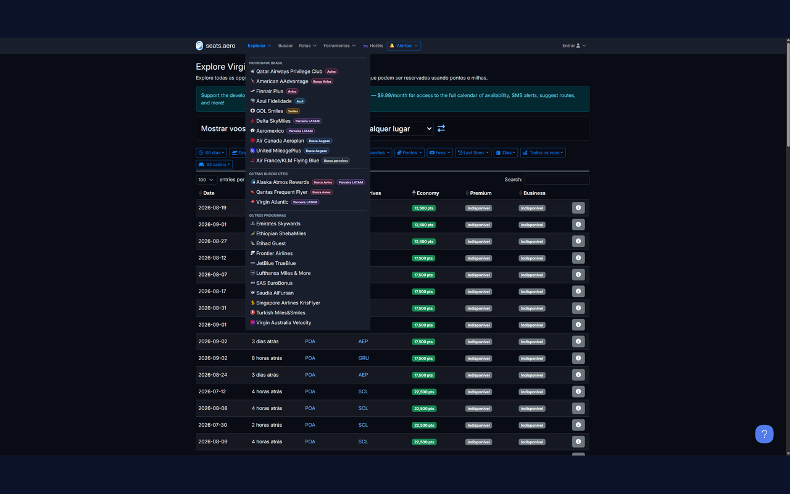

<p align="center">
  
</p>

<h1 align="center">Suas milhas têm preço. Veja antes de emitir.</h1>

<p align="center">
  O Supermilhas transforma pontos, milhas e Avios em estimativas claras em reais — diretamente nos sites onde você pesquisa passagens-prêmio.
</p>

<p align="center">
  <strong>Chrome Web Store: em análise</strong> · Manifest V3 · Sem anúncios · Sem telemetria
</p>

<p align="center">
  <a href="https://github.com/EriveltonLima/supermilhas/releases/tag/v1.0.0"><strong>Baixar Supermilhas 1.0.0</strong></a>
  &nbsp;·&nbsp;
  <a href="https://github.com/EriveltonLima/supermilhas/issues">Relatar um problema</a>
  &nbsp;·&nbsp;
  <a href="PRIVACY.md">Privacidade</a>
</p>

---

## Decida com números, não com sensação

Uma passagem por 60.000 pontos pode parecer barata — até você considerar quanto custou cada milheiro. O Supermilhas preserva o valor original e acrescenta a estimativa em reais usando o CPM configurado por você.

- Compare programas usando a mesma referência em reais.
- Veja o custo das milhas sem fazer contas manualmente.
- Considere milhas + dinheiro no total estimado da LATAM.
- Abra consultas LATAM Pass a partir do Seats.aero e Google Voos.
- Identifique moedas, parceiros, temporadas e tabelas com mais contexto.

```text
60.000 Avios ÷ 1.000 × R$ 39 = R$ 2.340
```

Você controla o CPM. A extensão ajuda a interpretar o resultado.

## Veja o Supermilhas em ação

<p align="center">
  
</p>

<p align="center"><em>Booking Options com programas, contexto de tabela e valores estimados em reais.</em></p>

<p align="center">
  
</p>

<p align="center"><em>Opções Avios &amp; Money comparadas sem esconder o valor original.</em></p>

## Onde funciona

| Site | O que o Supermilhas acrescenta |
|---|---|
| **Seats.aero** | Conversão das opções com programa explícito, contexto de tabelas e atalhos de consulta |
| **Explore do Seats.aero** | Ordem voltada ao público brasileiro, badges de moeda/parceria e separadores |
| **SeatSpy** | Valor em reais no hover do calendário e no modal de detalhes |
| **Iberia** | Conversão de Avios e opções Avios + dinheiro |
| **Qatar Airways** | Conversão nos cartões de cabine e calendário semanal |
| **LATAM Airlines** | Custo das milhas e total estimado nas combinações milhas + dinheiro |
| **Google Voos** | Botão “Milhas” em resultados LATAM para consultar a rota no LATAM Pass |

## Feito para a realidade brasileira

Configure valores independentes para:

- LATAM Pass;
- Avios — Iberia, Qatar, Finnair, British e outros;
- Smiles;
- Azul Fidelidade;
- Aegean Miles+Bonus.

O Explore do Seats.aero também ganha uma organização mais útil para quem combina programas brasileiros, Avios e parceiros internacionais.

<p align="center">
  
</p>

## Instalação para testes

Enquanto a publicação na Chrome Web Store está em análise:

1. Baixe a [release mais recente](https://github.com/EriveltonLima/supermilhas/releases/tag/v1.0.0).
2. Extraia `supermilhas-chrome.zip`.
3. Abra `chrome://extensions`.
4. Ative **Modo do desenvolvedor**.
5. Clique em **Carregar sem compactação**.
6. Selecione a pasta extraída que contém `manifest.json`.

Mantenha apenas uma instalação ativa para evitar etiquetas duplicadas.

## Privacidade de verdade

- Todo cálculo acontece localmente no navegador.
- Não existe servidor do Supermilhas.
- Não há anúncios, analytics ou telemetria.
- Pesquisas de voo e conteúdo das páginas não são enviados ao desenvolvedor.
- CPMs e preferências ficam em `chrome.storage.local`.

Leia a [Política de Privacidade](PRIVACY.md) e o [modelo de segurança](SECURITY.md).

## Transparência

O Supermilhas é uma ferramenta de apoio à decisão. As estimativas não garantem disponibilidade, elegibilidade ou preço final. Taxas, sobretaxas, inventário de parceiros e regras Peak/Off-Peak devem ser confirmados no programa emissor.

O projeto é independente e não possui vínculo com companhias aéreas, programas de fidelidade, Seats.aero, SeatSpy ou Google.

## Ajude a melhorar

Sites de viagens mudam frequentemente. Se uma etiqueta não aparecer ou um valor parecer incorreto, abra uma [Issue](https://github.com/EriveltonLima/supermilhas/issues) com uma captura e um pequeno trecho do HTML — sempre removendo dados pessoais.

Se o Supermilhas ajudou em uma boa emissão, você pode apoiar o desenvolvimento:

**Pix:** `erivelton.lima.tech@gmail.com`

<details>
<summary><strong>Desenvolvimento e publicação</strong></summary>

### Estrutura

```text
manifest.json           Manifest V3 e sites permitidos
content.js              Inicialização do script
settings.js             CPMs e configurações locais
lib/mileage.js          Cálculos e integrações
styles.css              Etiquetas inseridas nas páginas
popup.*                 Configuração da extensão
about.*                 Apresentação e FAQ
docs/                   Publicação e texto da loja
scripts/                Geração dos recursos gráficos
capturas/store-assets/  Imagens prontas para a Store
```

### Verificação

```powershell
node --check content.js
node --check settings.js
node --check popup.js
node --check about.js
node --check lib/mileage.js
Get-Content -Raw manifest.json | ConvertFrom-Json | Out-Null
```

### Recursos da Chrome Web Store

```powershell
.\scripts\generate-store-assets.ps1
```

Consulte o [guia completo da Chrome Web Store](docs/CHROME_WEB_STORE.md) e o [texto sugerido para a listagem](docs/STORE_LISTING.md).

</details>
